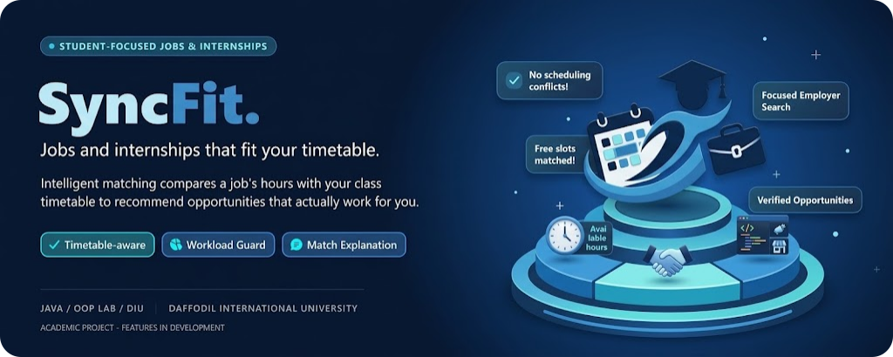

<div align="center">
  
  <h1>SyncFit</h1>

[](https://www.oracle.com/java/)
[](https://maven.apache.org/)
[](https://docs.oracle.com/javase/tutorial/uiswing/)
[](https://www.postgresql.org/)
[](https://neon.tech/)
[](#roadmap)


**SyncFit** is a desktop application that connects university students with
part-time jobs and internships that fit their class timetable. Instead of
showing every listing, SyncFit compares a job's working hours with a
student's free time and recommends opportunities that can actually work.
</div>

## Objectives

- Help students discover work opportunities compatible with their schedules.
- Match job and internship hours with timetable availability.
- Reduce schedule conflicts and prevent unreasonable workloads.
- Give employers a focused way to reach suitable student candidates.

## Key features

- **Timetable-aware matching** - match jobs against a student's class schedule.
- **Workload guard** - warn about or block schedules that overload a student.
- **Match explanation** - show why a job was recommended.
- **Student profile** - manage skills, preferences, and weekly availability.
- **Employer panel** - post and manage jobs and internships.
- **Search and filtering** - browse opportunities by category, hours, and type.

> Features are under active development and may change as the project evolves.

## Tech stack

| Area                              | Technology     |
| --------------------------------- | -------------- |
| Language and runtime              | Java 17+       |
| Build and dependency management   | Apache Maven   |
| Desktop user interface            | Java Swing     |
| Relational database               | PostgreSQL     |
| Hosted database environment       | Neon           |
| Version control and collaboration | Git and GitHub |

## Project structure

The project is currently being set up. The expected Maven layout is:

```text
SyncFit/
├── pom.xml
├── README.md
├── CONTRIBUTING.md
├── LICENSE
└── src/
    ├── main/
    │   ├── java/
    │   └── resources/
    └── test/
        ├── java/
        └── resources/
```

## Getting started

### Prerequisites

- Java JDK 17 or later
- Apache Maven
- Git
- Access to the SyncFit PostgreSQL database on Neon when database features
  are available

### Clone the repository

```bash
git clone https://github.com/NOSIBBiswas22/SyncFit.git
cd SyncFit
```

Build and run commands will be added when the Maven application structure is
committed.

## Team

**Section:** 69_I1 | **Institution:** Daffodil International University

| Role      | Student ID | Name                   | GitHub                                                   |
| --------- | ---------- | ---------------------- | -------------------------------------------------------- |
| Team Lead | 252-15-887 | Nosib Biswas           | [@NOSIBBiswas22](https://github.com/NOSIBBiswas22)       |
| Member 2  | 252-15-042 | Shakib Hossen          | [@arshakib42](https://github.com/arshakib42)             |
| Member 3  | 252-15-476 | Abrar Arham            | [@abrararham476](https://github.com/abrararham476)       |
| Member 4  | 252-15-551 | Addoito Basak Rajkumar | [@rajkumarbasak565](https://github.com/rajkumarbasak565) |
| Member 5  | 252-15-542 | Ovi Musully            | [@ovimusully](https://github.com/ovimusully)             |

### Contributors


## Roadmap

### Phase 1: Planning and foundation

- [x] Complete the project proposal and form the team
- [x] Document the project scope, technology stack, and contribution workflow
- [ ] Create the Java 17 Maven project structure
- [ ] Configure Maven dependencies, packaging, and development profiles
- [ ] Establish the initial application entry point and package structure

### Phase 2: Database and core models

- [ ] Design the PostgreSQL schema
- [ ] Create models for students, employers, jobs, timetables, and applications
- [ ] Set up the Neon development database
- [ ] Add database connection and repository/data-access layers
- [ ] Add schema migrations and seed data for local development

### Phase 3: Matching engine

- [ ] Implement timetable and weekly availability management
- [ ] Build job-hour and student-availability conflict detection
- [ ] Implement timetable-aware job and internship matching
- [ ] Add workload limits and overload warnings
- [ ] Display clear explanations for each match result

### Phase 4: Swing desktop application

- [ ] Build the student registration and profile screens
- [ ] Build timetable and availability management screens
- [ ] Build job search, filtering, and details screens
- [ ] Build employer job posting and management screens
- [ ] Add application tracking and status management
- [ ] Connect Swing screens to the matching engine and database

### Phase 5: Quality and delivery

- [ ] Add unit tests for matching, workload, and validation logic
- [ ] Add integration tests for PostgreSQL data access
- [ ] Test the main student and employer workflows
- [ ] Fix bugs and improve usability
- [ ] Prepare project documentation and presentation
- [ ] Complete the final project demonstration

## Contributing

SyncFit is a public academic project, so anyone can view the repository.
Contributions and write access are currently limited to approved GitHub
collaborators. If you are not an approved collaborator, please do not submit
changes directly to this repository. Collaborators must follow the complete
workflow in [CONTRIBUTING.md](CONTRIBUTING.md).

## License

This project is created for academic purposes at Daffodil International
University. See [LICENSE](LICENSE) for details.